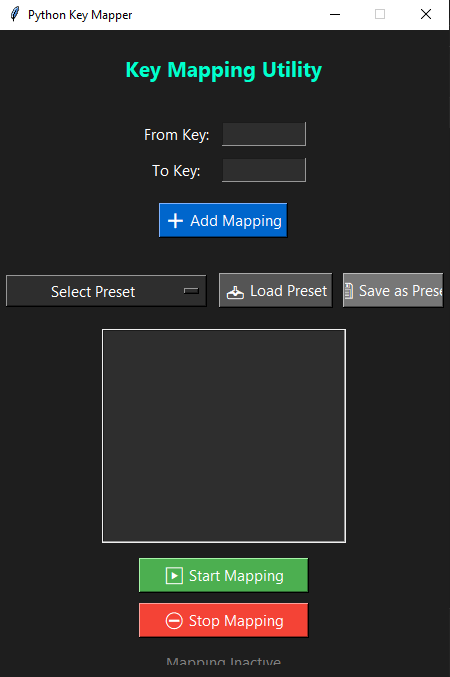

🔑✨ KeyMapper - Custom Keyboard Remapper with Preset Support

🎉 KeyMapper is a simple yet powerful Python-based GUI application that allows users to map individual keys and manage multiple custom presets easily.

💡 Features

🎛️ Graphical User Interface (built using tkinter)
🔁 Add individual key mappings (map one key to another)
📁 Preset system – create, save, and switch between keybinding profiles
💾 Save/Load mappings for future use
🧠 Beginner-friendly and open-source

📸 Preview
(Add a screenshot here if you have one)

🚀 Getting Started
Clone the repository:

pip install -r requirements.txt
Run the app:

More Discussed In Readme Files

📌 To-Do / Upcoming Features

🌙 Dark mode support
⌨️ Custom keybinding UI interface
☁️ Cloud sync (optional)
🪟 Minimize to tray

🤝 Contributing
Pull requests are welcome! Feel free to fork this project and submit improvements.

📜 License
This project is open-source and available under the MIT License.
